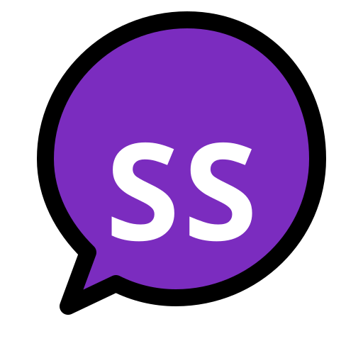

  

# ScriptScreen

A minimalist, high-contrast, distraction-free digital communication board designed for individuals who are temporarily unable to speak or require a simple text-display tool. 

ScriptScreen runs entirely in the browser as an offline-first Progressive Web App (PWA) with zero dependencies, making it fast, secure, private, and capable of working seamlessly behind restrictive firewalls or offline environments.

🌐 **Live App:** [https://kanrog.github.io/ScriptScreen/](https://kanrog.github.io/ScriptScreen/)

## Why I Made ScriptScreen

I am diagnosed with Autism and Bipolar Disorder. Sometimes, when those two group up and get bad at the same time, one of the things that happens to me is that I lose the ability to speak. In addition to dealing with depression, anxiety, and being asocial, I completely stop speaking.

Over the years, I have become more comfortable communicating with people I trust by writing. During a recent episode, I tried to cheer myself up by keeping busy with projects, and ScriptScreen was born. It has transformed the way I communicate during these episodes, especially when having longer, deeper conversations. 

By using my laptop with a second monitor connected, I can sit face-to-face with someone and have a conversation 95% like normal without stressing about them waiting for me to type and show them my screen on a phone or laptop. 

Hopefully, ScriptScreen can help someone who needs a tool to assist them in having a better day. If it helps even just one person, I will be beyond happy.

## Features

* **High Contrast:** Pure black background with crisp white text for maximum readability from a distance.
* **Smart Text Wrapping:** Automatically wraps text to fit the screen width, preventing awkward horizontal scrolling.
* **Text-to-Speech & Voice Selector:** Tap the **Speak** button (or press `Ctrl + Enter` / `Cmd + Enter`) to voice your message aloud using your browser's local text-to-speech engine. Use the **Voice Dropdown** next to it to switch between any available speech profiles and language packs installed on your device.
* **Message History:** Automatically saves up to your last 10 typed and cleared messages to local storage. Use the **History Dropdown** to instantly reload previous phrases.
* **180° Tabletop Rotation:** Tap the `180°` button to flip the text upside down, allowing someone sitting opposite you to read it easily while the phone rests flat on a table between you.
* **Adjustable Font Size:** Built-in `A-` and `A+` buttons allow you to instantly scale the text size to your preference. You can also use `Page Up` and `Page Down` on your keyboard. 
* **Persistent Preferences:** Automatically saves your preferred font size using your browser's local storage.
* **Quick Reset & Clear:** Easily clear the screen using the `Delete` key on your keyboard or tap the dedicated `Clear` button in the bottom control bar (which also automatically saves your message to history).
* **Offline-First PWA:** Powered by a Service Worker for instant loading and full offline capability without internet dependencies.
* **Mobile Optimized:** Dynamic viewport sizing (`dvh` and interactive widget support) ensures controls and virtual keyboards never overlap or hide your text area.
* **Zero Dependencies:** Contained entirely within a single HTML file with no external servers, databases, or trackers. 100% private.

## How to Use

1. **Open the App:** Visit [https://kanrog.github.io/ScriptScreen/](https://kanrog.github.io/ScriptScreen/) in any modern web browser or open your installed PWA.
2. **Type Your Message:** Click or tap anywhere on the screen to focus the large text area and start typing your message.
3. **Voice Your Message:** 
   * Click the **Speak** button in the bottom toolbar, or press **`Ctrl + Enter`** (`Cmd + Enter` on Mac) to have your device read the text aloud.
   * Use the **Voice Dropdown** menu next to the Speak button to switch between different speech profiles, accents, or language packs installed on your device.
4. **Recall Past Messages:** Access your previously spoken or cleared phrases by selecting them from the **History** dropdown menu.
5. **Clear the Screen:** Tap the red **Clear** button in the control bar or press the **`Delete`** key on your keyboard to wipe the board clean (this also automatically saves the message to your history log).
6. **Flip for Tabletop Conversation:** Tap the **`180°`** button to invert the text upside down when laying the device flat on a table between you and someone else.
7. **Resize Text:** Use the **`A+`** and **`A-`** buttons, or press **`Page Up` / `Page Down`** on your keyboard, to scale the text size instantly.

### Tip!
  If you're using a laptop or desktop, clone your display to a secondary monitor or connect a phone/tablet using an app like Spacedesk. This allows your messages to be easily viewable from multiple angles at once.

## Installing as a True App (PWA)

Because ScriptScreen is built as a Progressive Web App with an offline service worker, you can install it as a standalone application on your device rather than just bookmarking it as a browser tab. This gives you a dedicated app window without browser address bars, plus full offline functionality.

### On Desktop (Chrome, Edge, or Brave)
1. Open [https://kanrog.github.io/ScriptScreen/](https://kanrog.github.io/ScriptScreen/).
2. Look at the right side of your browser's address bar for the **Install icon** (a small monitor with a downward arrow) or open your browser's main menu (three dots).
3. Select **Install ScriptScreen** (or *Apps -> Install this site as an app*).
4. Confirm the installation. ScriptScreen will open in its own standalone window and add an icon to your desktop or applications menu.

### On Android (Chrome or Samsung Internet)
1. Open [https://kanrog.github.io/ScriptScreen/](https://kanrog.github.io/ScriptScreen/).
2. Open the browser menu (three dots in the top right).
3. Tap **Install app** or **Add to Home screen**. *(Note: If it prompts you, select "Install" rather than just creating a shortcut so it launches in full standalone mode).*
4. The app icon will appear on your home screen or app drawer, running independently from your browser tabs.

### On iOS (Safari)
1. Open [https://kanrog.github.io/ScriptScreen/](https://kanrog.github.io/ScriptScreen/).
2. Tap the **Share** button at the bottom of the screen.
3. Scroll down and tap **Add to Home Screen**.
4. Tap **Add** in the top right corner. ScriptScreen will install as a full-screen app icon on your home screen.
## License

This project is open-source and free to use under the terms of the GNU General Public License v3.0 (GPLv3)

© Kanrog Creations
